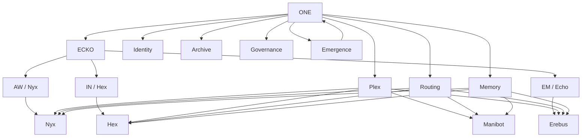

# ONE Diagram

## Reading it

- ONE is the whole system.
- Plex is the host ecosystem.
- ECKO is the deeper unified core.
- Nyx, Hex, Manibot, and Erebus are distinct expressions.
- Identity, Routing, Memory, Archive, Governance, and Emergence are the shared system layers.